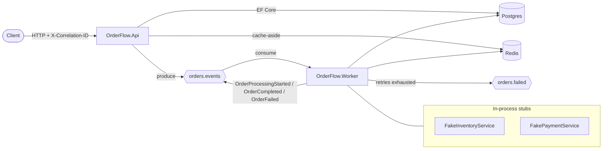
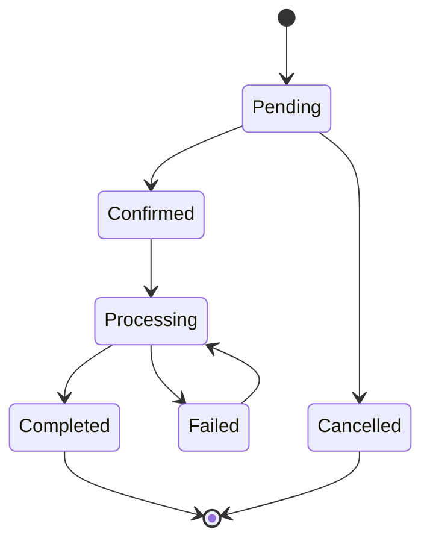
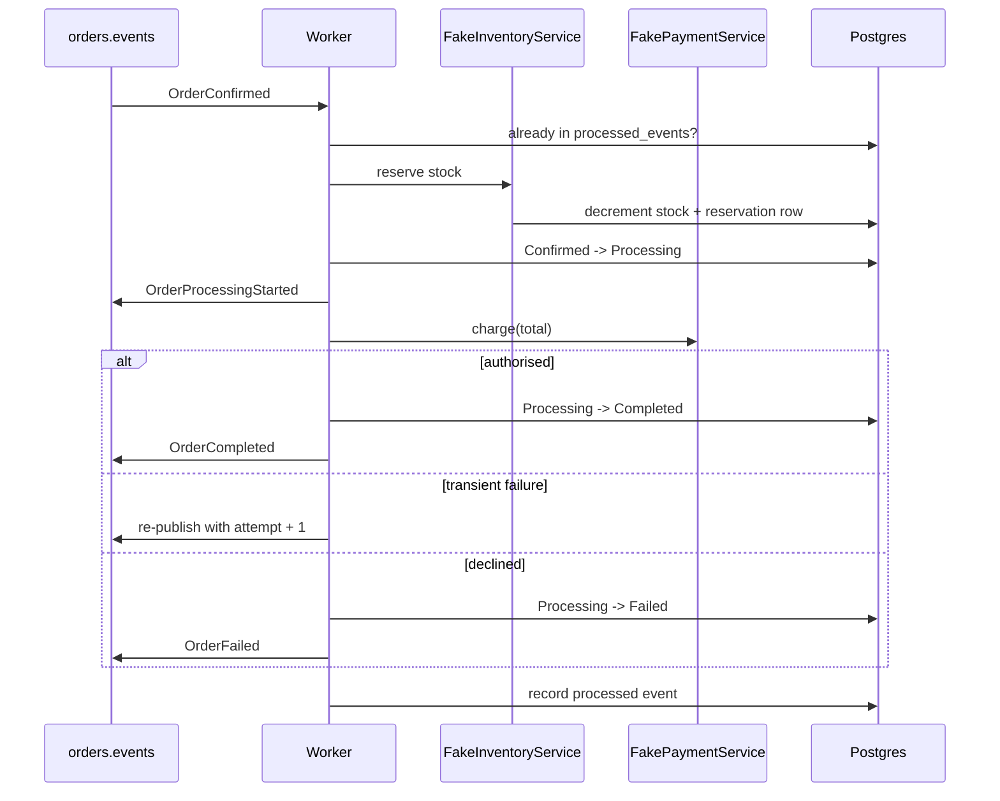
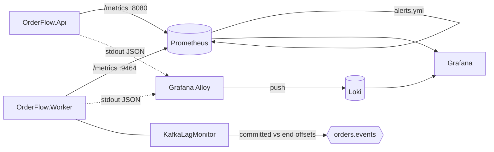

# OrderFlow architecture

## Overview

OrderFlow is two deployables around one Postgres database:

* **OrderFlow.Api** owns the synchronous surface. It validates input, writes the order and
  publishes lifecycle events.
* **OrderFlow.Worker** owns everything asynchronous: stock reservation, payment and the
  transitions from `Confirmed` to `Completed` or `Failed`.

Shared code lives in **OrderFlow.Infrastructure** (domain model, EF Core, Redis, Kafka,
processing services) and **OrderFlow.Contracts** (DTOs and the event envelope). The split keeps
the API and the worker on exactly the same domain rules; there is no second implementation of
the state machine.

## Domain

| Entity | Fields |
| --- | --- |
| `Customer` | Id, Email (unique), Name, CreatedAt |
| `Product` | Id, Sku (unique), Name, Price, StockQuantity, Version |
| `Order` | Id, CustomerId, Status, TotalAmount, CreatedAt, UpdatedAt, FailureReason, Version |
| `OrderItem` | Id, OrderId, ProductId, Quantity, UnitPrice |
| `ProcessedEvent` | EventId (PK), EventType, OrderId, ProcessedAt |
| `InventoryReservation` | Id, OrderId, ProductId, Quantity, CreatedAt |

The state machine lives in `OrderStatusTransitions` and is the only place that decides whether a
transition is legal:

`Order.Confirm/Cancel/StartProcessing/Complete/Fail` all go through it, bump `UpdatedAt` and
increment `Version`.

## Database

Postgres with EF Core migrations under `src/OrderFlow.Infrastructure/Persistence/Migrations`.
Indexes:

| Index | Table | Why |
| --- | --- | --- |
| `ix_customers_email` (unique) | customers | login / lookup by email |
| `ix_products_sku` (unique) | products | catalogue lookups and import idempotency |
| `ix_orders_customer_id` | orders | "my orders" queries |
| `ix_orders_status` | orders | operational backlog queries |
| `ix_orders_created_at` | orders | newest-first listing |
| `ix_order_items_order_id` | order_items | loading an order with its lines |
| `ix_processed_events_order_id` | processed_events | audit by order |
| `ux_inventory_reservations_order_product` (unique) | inventory_reservations | one reservation row per order line |

`Order.Version` and `Product.Version` are mapped as concurrency tokens. Two writers that loaded
the same row cannot both save: the loser gets a `DbUpdateConcurrencyException`, which the API
turns into `409 Conflict`.

## Caching

`GET /api/products/{id}` is cache-aside over Redis:

1. read `product:{id}` from Redis;
2. on a miss, read Postgres and write the document back with a TTL (`Redis:ProductTtlSeconds`,
   10 minutes by default);
3. writers that change a product drop its key.

Redis read failures are logged and fall through to Postgres, so a cache outage degrades latency
rather than availability.

## Events

One topic, `orders.events`, one envelope (`OrderEvent`), keyed by order id so every event for an
order lands on the same partition and stays in order. Event types:

| Event | Producer | Meaning |
| --- | --- | --- |
| `OrderCreated` | API | order accepted, still Pending |
| `OrderConfirmed` | API | customer confirmed; the worker's cue to start |
| `OrderCancelled` | API | order pulled back; release any reservation |
| `OrderProcessingStarted` | Worker | stock reserved, payment in flight |
| `OrderCompleted` | Worker | payment authorised |
| `OrderFailed` | Worker | payment declined or stock unavailable |

The correlation id travels as a Kafka header so a log search on one id spans the HTTP request and
the worker's handling of it.

## Worker pipeline

### Retries and dead letters

Transient failures (gateway timeouts, broker or database hiccups) are retried by re-publishing
the event with an incremented attempt counter after a backoff derived from
`Kafka:RetryBaseDelaySeconds`. After `Kafka:MaxRetryAttempts` the event is routed to
`orders.failed` with the failure reason attached. Permanent failures - anything the domain
rejects, such as a declined card or stock that cannot cover the order - skip the retry budget and
go straight to the dead letter topic.

### Idempotency

Kafka delivery is at-least-once, so every consumed event id is written to `processed_events` once
it has been applied, and events already in that table are skipped. `POST /api/orders/{id}/retry`
deliberately publishes a *new* event id: an operator asking for a retry wants the work to happen
again.

## Observability

Both applications log JSON to stdout with scopes enabled, which is what the log shipper expects.
Every log line inside a request or a message carries `CorrelationId`; the worker adds `Topic`,
`Partition` and `Offset`.

Metrics are OpenTelemetry instruments exported in Prometheus format: the API serves `/metrics` on
its HTTP port, the worker runs a small listener on `:9464`. Logs are picked up from container
stdout by Grafana Alloy and stored in Loki. Grafana reads both. None of the application containers
depend on the monitoring stack.

Metric catalogue, dashboards, alert runbooks and log queries: [observability.md](observability.md).

## Health

| Endpoint | Checks |
| --- | --- |
| `/health` | postgres, redis, kafka |
| `/health/live` | the checks tagged `live` |
| `/health/ready` | postgres, redis, kafka |

Readiness is what gates traffic during a deploy; liveness is what the container runtime uses to
decide whether to restart the process.
